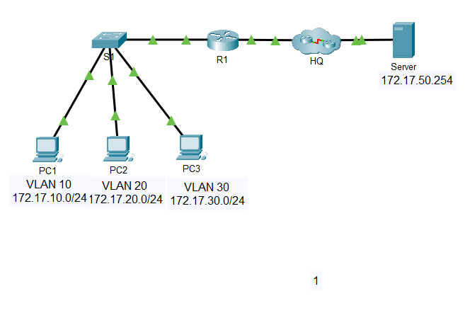

# Lab: Inter-VLAN Routing (Router-on-a-Stick)

## Objective

Implement inter-VLAN routing using a single trunk link between a switch (S1) and a router (R1). The lab covers IP addressing, VLAN creation and port assignment, a static 802.1Q trunk with a custom native VLAN, router subinterfaces, securing unused ports, and end-to-end connectivity testing.

## Topology



Summary: `PC1/PC2/PC3 -> S1 -> (trunk G0/1) -> R1 -> (G0/0, /30 link) -> HQ cloud -> Server`

## Addressing Table

| Device | Interface | IP Address | Subnet Mask | Default Gateway |
|---|---|---|---|---|
| R1 | G0/0 | 172.17.25.2 | 255.255.255.252 | N/A |
| R1 | G0/1.10 | 172.17.10.1 | 255.255.255.0 | N/A |
| R1 | G0/1.20 | 172.17.20.1 | 255.255.255.0 | N/A |
| R1 | G0/1.30 | 172.17.30.1 | 255.255.255.0 | N/A |
| R1 | G0/1.88 | 172.17.88.1 | 255.255.255.0 | N/A |
| R1 | G0/1.99 | 172.17.99.1 | 255.255.255.0 | N/A |
| S1 | VLAN 99 | 172.17.99.10 | 255.255.255.0 | 172.17.99.1 |
| PC1 | NIC | 172.17.10.21 | 255.255.255.0 | 172.17.10.1 |
| PC2 | NIC | 172.17.20.22 | 255.255.255.0 | 172.17.20.1 |
| PC3 | NIC | 172.17.30.23 | 255.255.255.0 | 172.17.30.1 |
| Server | NIC | 172.17.50.254 | 255.255.255.0 | 172.17.50.1 |

## VLAN and Port Assignments

| VLAN | Name | Interfaces |
|---|---|---|
| 10 | Faculty/Staff | F0/11-17 |
| 20 | Students | F0/18-24 |
| 30 | Guest(Default) | F0/6-10 |
| 88 | Native | G0/1 (trunk native VLAN) |
| 99 | Management | VLAN 99 (SVI) |

## How It Works

VLANs are separate Layer 2 broadcast domains, so hosts in different VLANs cannot talk through the switch alone. In router-on-a-stick:

1. S1's G0/1 is an 802.1Q trunk carrying all VLANs to R1.
2. R1's physical G0/1 has no IP address. It is split into **subinterfaces** (G0/1.10, .20, .30, .88, .99), each tied to one VLAN with `encapsulation dot1Q <vlan-id>`.
3. Each subinterface IP is the default gateway for its VLAN.
4. A packet from PC1 to PC2 goes to R1 on VLAN 10, is routed, then goes back out the same link tagged as VLAN 20.

Key distinction: the switch uses an **SVI** (`interface vlan 99`) only for its own management IP. The router uses **subinterfaces** with `encapsulation dot1Q` for tagging. The switch has no per-VLAN encapsulation setting; tagging happens on the trunk port.

## Configuration Steps

Full configs are in [`configs/R1.txt`](configs/R1.txt) and [`configs/S1.txt`](configs/S1.txt).

### Step 1: Create and name VLANs on S1

Names must match the table exactly (case and punctuation).

```
vlan 10
 name Faculty/Staff
vlan 20
 name Students
vlan 30
 name Guest(Default)
vlan 88
 name Native
vlan 99
 name Management
```

### Step 2: Management IP and default gateway on S1

```
interface vlan 99
 ip address 172.17.99.10 255.255.255.0
 no shutdown
ip default-gateway 172.17.99.1
```

An L2 switch uses `ip default-gateway` (not `ip route`) for its own management traffic.

### Step 3: Assign access ports

```
interface range f0/11 - 17
 switchport mode access
 switchport access vlan 10
interface range f0/18 - 24
 switchport mode access
 switchport access vlan 20
interface range f0/6 - 10
 switchport mode access
 switchport access vlan 30
```

### Step 4: Configure the static trunk on S1

```
interface g0/1
 switchport mode trunk
 switchport trunk native vlan 88
```

On a 2960 only 802.1Q is supported, so no encapsulation command is needed. On a 3560 you must first enter `switchport trunk encapsulation dot1q`.

### Step 5: Disable unused ports

Ports not assigned to a VLAN (F0/1-5 and G0/2) are shut down.

```
interface range f0/1 - 5
 shutdown
interface g0/2
 shutdown
```

### Step 6: Configure subinterfaces on R1

```
interface g0/1
 no shutdown
interface g0/1.10
 encapsulation dot1Q 10
 ip address 172.17.10.1 255.255.255.0
interface g0/1.20
 encapsulation dot1Q 20
 ip address 172.17.20.1 255.255.255.0
interface g0/1.30
 encapsulation dot1Q 30
 ip address 172.17.30.1 255.255.255.0
interface g0/1.88
 encapsulation dot1Q 88 native
 ip address 172.17.88.1 255.255.255.0
interface g0/1.99
 encapsulation dot1Q 99
 ip address 172.17.99.1 255.255.255.0
```

Always set `encapsulation dot1Q` **before** `ip address`, or IOS rejects the address. The `native` keyword goes on the native VLAN's subinterface (88), and must match the switch trunk's native VLAN.

### Step 7: Configure R1 G0/0

```
interface g0/0
 ip address 172.17.25.2 255.255.255.252
 no shutdown
```

### Step 8: Route to the server network

The server (172.17.50.254) is not on any network directly connected to R1. In a /30 with R1 at .2, the only other host address is 172.17.25.1, so I used it as the next hop:

```
ip route 172.17.50.0 255.255.255.0 172.17.25.1
```

> **Assumption:** the device at the other end of R1 G0/0 is the HQ cloud, and the server sits behind it. The addressing table does not list HQ's IP, so 172.17.25.1 is inferred from the /30. Confirm with `ping 172.17.25.1` from R1.

### Step 9: Configure end devices

Set static IPs on PC1, PC2, PC3, and the server in Packet Tracer (**Desktop > IP Configuration**) using the addressing table.

## Verification

Commands used:

```
S1# show vlan brief
S1# show interfaces trunk
S1# show ip interface brief
R1# show ip interface brief
R1# show ip route
```

Connectivity tests (all should succeed):

- PC1, PC2, PC3 ping their own gateways
- PC to PC across VLANs
- PCs and R1 to S1 (172.17.99.10)
- All devices to the server

> Add screenshots or pasted output here. The first ping often times out while ARP resolves, so retry before troubleshooting.

## Troubleshooting Notes

The Packet Tracer **Check Results** screen flagged these issues on my first attempt:

| Issue | Cause | Fix |
|---|---|---|
| R1 G0/1.88 native VLAN incorrect | Subinterface was not marked native | `encapsulation dot1Q 88 native` |
| S1 default gateway incorrect | `ip default-gateway` not set | `ip default-gateway 172.17.99.1` |
| S1 G0/2 port status incorrect | Unused port was still up | `interface g0/2` then `shutdown` |
| VLAN 10 and VLAN 30 names incorrect | Names did not match the table exactly | Re-enter `Faculty/Staff` and `Guest(Default)` |

Lessons learned:

- A native VLAN mismatch between the switch trunk and the router subinterface causes problems. Set it on both ends.
- Checkers compare names literally, so watch capitalization, spaces, and punctuation.
- "Unused" ports include the spare gigabit port, not just the FastEthernet ones.
- I initially put `native` on the VLAN 99 subinterface. The lab specified VLAN 88 as native, so the addressing and VLAN tables should be read before configuring.

## Takeaways

- Router-on-a-stick uses one trunk and one subinterface per VLAN.
- Tagging is configured on the router per subinterface, and on the switch only at the trunk port.
- SVIs are for switch management IPs. Subinterfaces are for router gateways.
- Connected routes appear automatically for each subinterface, so no static routes are needed between the VLANs.
